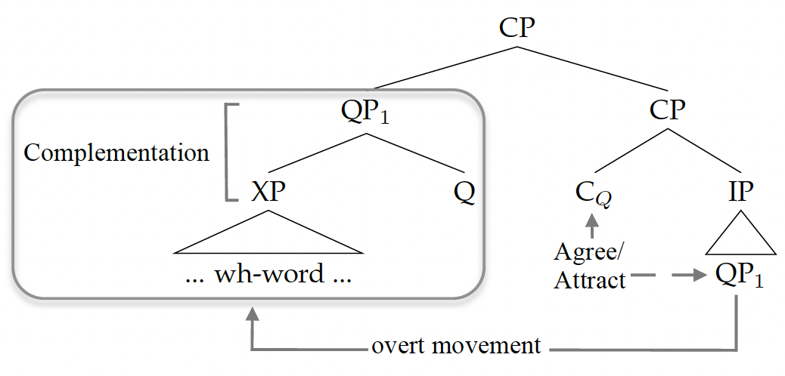

# 👀 LaTeX for linguists 👀

Are you a linguist and tired of images and tables floating around in your papers? Are you writing your dissertation and your text editor keeps crashing? Do you wonder how to draw pretty tree diagrams such as the one right here?

Look no further, you're in the right place! 🥳 In this course, I'll teach you how to use [LaTeX](https://www.latex-project.org/), a high-quality typesetting system, to write about linguistics and more generally the humanities.

> **LaTeX for linguists** has no prerequisites. You'll just need your computer and an internet connection. Once you've read about the structure of the course below, just move to the 'Chapters' folder and start learning!

## 🌳 Structure 🌳

1. Intro
2. Chapter 1
3. Chapter 2
4. Chapter 3
5. Chapter 4
6. Chapter 5
